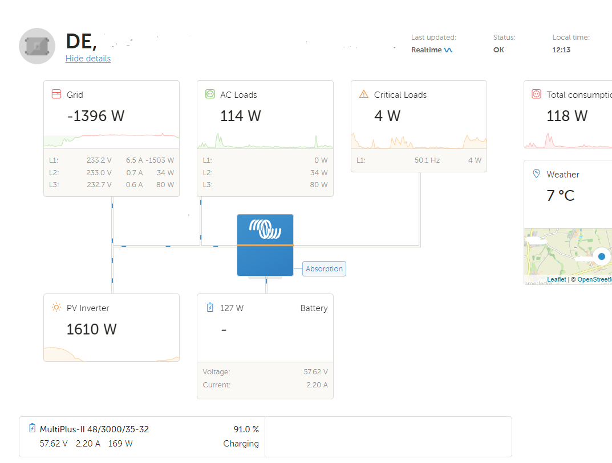
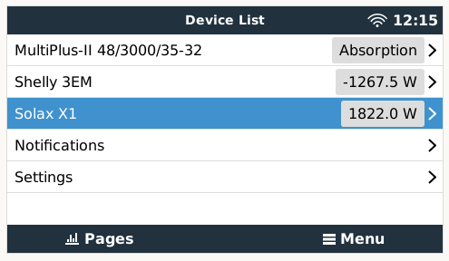
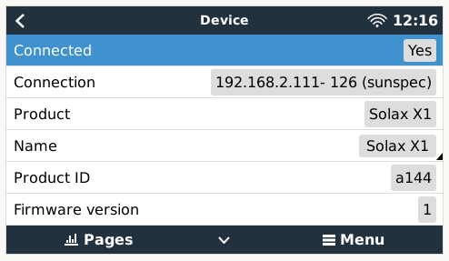

# dbus-solax-x1-pvinverter
Get production values from Solax Cloud for X1 inverter and feed them into [Victron Energies Venus OS](https://github.com/victronenergy/venus) DBus to make same available on CCGX and VRM portal


## Purpose
I wanted to get a least some values from my PV inverter into the VRM portal.
Even if the **limitation of this setup** is, that values on Solax Cloud are only updated every 5 minutes.
Solax X1 inverter offer ModBus support, but I am not that deep into it, so lets go for the cloud/RESTapi way ;-)


## Inspiration
This project is one of my first projects on GitHub and with Victron components as well as in Python.
So for this one here I cook basicaly the code from my [Shelly 3EM Smartmeter into DBus integration](https://github.com/fabian-lauer/dbus-shelly-3em-smartmeter/).


## How it works
### My setup
- Shelly 3EM with latest firmware (20220209-094824/v1.11.8-g8c7bb8d)
  - 3-Phase installation (normal for Germany)
  - Connected to Wifi netowrk "A"
  - IP 192.168.2.108/24  
- Victron Energy Cerbo GX with Venus OS - Firmware v2.84
  - Connected to Wifi netowrk "A"
  - IP 192.168.2.110/24
- Victron MultiPlus II 48/3000
- Solax X1 Boost 5.0 DT
  - 5kW
  - Wifi Stick
  - Solax Cloud account with API credentials


### Details / Process
As mentioned above the script is inspired by @RalfZim fronius smartmeter implementation.
So what is the script doing:
- Running as a service
- connecting to DBus of the Venus OS `com.victronenergy.pvinverter.pv_[SERIAL-OF-INVERTER]`
- After successful DBus connection Solax Cloud is accessed via REST-API and a JSON is returned with all details  
- Serial/MAC is taken from the response as device serial
- Paths are added to the DBus with default value 0 - including some settings like name, etc
- After that a "loop" is started which pulls data every xxx ms from the REST-API and updates the values in the DBus

Thats it 😄


### Pictures

 




## Install & Configuration
### Get the code
Just grap a copy of the main branche and copy them to `/data/dbus-solax-x1-pvinverter`.
After that call the install.sh script.

The following script should do everything for you:
```
wget https://github.com/fabian-lauer/dbus-solax-x1-pvinverter/archive/refs/heads/main.zip
unzip main.zip "dbus-solax-x1-pvinverter-main/*" -d /data
mv /data/dbus-solax-x1-pvinverter-main /data/dbus-solax-x1-pvinverter
chmod a+x /data/dbus-solax-x1-pvinverter/install.sh
/data/dbus-solax-x1-pvinverter/install.sh
rm main.zip
```
⚠️ Check configuration after that - because service is already installed an running and with wrong connection data (host, username, pwd) you will spam the log-file


### Change config.ini
Within the project there is a file `/data/dbus-solax-x1-pvinverter/config.ini` - just change the values

| Section  | Config vlaue | Explanation |
| ------------- | ------------- | ------------- |
| DEFAULT  | SignOfLifeLog  | Time in minutes how often a status is added to the log-file `current.log` with log-level INFO |
| SOLAXCLOUD  | Endpoint | API endpoint - should always be the same |
| SOLAXCLOUD  | TokenId | TokenId from Solax Cloud portal |
| SOLAXCLOUD  | RegNo | RegNo of inverter WifiStick |
| INVERTER  | Position | Refer to Victron documentation - 0=AC input 1; 1=AC output; 2=AC input 2 |
| INVERTER  | MaxPower | Inverter max AC power in watts |
| INVERTER  | GridVoltage | The voltage is not returned by RESTapi so we use this value to calculate the current based on power |
| INVERTER  | Phase | Phase your inverter is connected to |


## Used documentation
- https://github.com/victronenergy/venus/wiki/dbus#grid   DBus paths for Victron namespace
- https://github.com/victronenergy/venus/wiki/dbus-api   DBus API from Victron
- https://www.victronenergy.com/live/ccgx:root_access   How to get root access on GX device/Venus OS
- https://github.com/victronenergy/dbus-fronius   looked up some details here for SunSpec emulation
- https://www.victronenergy.com/live/ac_coupling:fronius   wanted to make it a fronius device - here are some details
- https://github.com/victronenergy/venus/wiki/installing-additional-python-modules   If you need to add additional Python modules - here you go, but not needed for the project

## Discussions on the web
This module/repository has been posted on the following threads:
- https://community.victronenergy.com/questions/127456/solax-x1-boost-50-dt-inverter-with-venusos-cerbo-g.html
